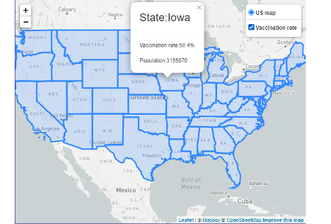
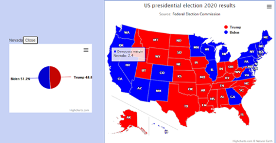
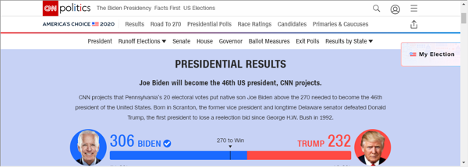

# COVID-19 Vaccinations and the 2020 Presidental Elections

## Team Members
 
Eugene Xu, Kiril Ivanov, Rachel Thorpe, Nabila Rizvi
 
## Introduction

Did the results of the 2020 election affect the number of individuals vaccinated (at least once) for COVID-19? The images below show a breakdown of vaccination rates, population by state and/or the 2020 election results. 
 
For our chosen javascript library we used Highcharts, which allowed us to produce a color-coded map of the election results. The Highcharts library also allowed us to include tooltips that feature a pie chart of voting percentages for each state.

Our process for cleaning data was to import the csv files we found from the United States Census Bureau, the Cook Political Report, and CovidActNow.org into python and to edit and clean the datasets using pandas. We then added the csv containing vaccination data into a geoJSON file in order to use it for our interactive Leaflet map. Next we transferred the US election data csv file to a Google doc in order to use that data with our Highcharts map. Finally we combined the three csv files in order to use them with our dynamic scatter plot. We used MongoDB to create a web scraping function, but ultimately decided an iFrame was a better way to display election data from CNN’s website.

Prior to our analysis, we explored the above-mentioned parameters in the datasets, cleaning them to remove irrelevant data, renaming columns and joining datasets. Our analysis showed that red states had lower overall COVID-19 vaccination rates in comparison to blue states. 

## Analysis & Results
 

 

Figure 1 Shows an interactive map with the total population and COVID-19 vaccination percentage by state.
 

 
Figure 2 shows an interactive map of the United States with the election results from 2020. When you click over a state it shows what is the Democrats margin and double click will open a pie chart with the results for that specific state.

Figure 3 shows a web-scraped page with the final election results.
 

 
Figure 4 shows a scatterplot comparing all fifty states, whether they were red or blue in the 2020 election and their COVID-19 vaccination rates.

  
## Conclusion

Our initial hypotheses for COVID-19 vaccination rates were that the higher the population the state has, the greater the vaccination rate. Our second hypothesis in terms of the 2020 election was that vaccination ratios by state would be dependent on whether it was blue or red. After analyzing the data, it is evident that states that voted for Donald Trump have shown to have a weak negative correlation. The data further shows that states that voted for Joe Biden have a weak positive correlation. The population versus vaccination ratio data does not show a statistically significant relationship.

## Sources
 

Leaflet Map // United States Census Bureau & CovidActNow.org: (https://www.census.gov/data/developers/data-sets/popest-popproj/popest.html)
(https://covidactnow.org/) 
 
Highchart Map // The Cook Political Report: (https://cookpolitical.com/2020-national-popular-vote-tracker)
 
Webscrape // CNN: (https://www.cnn.com/election/2020/results/president)
